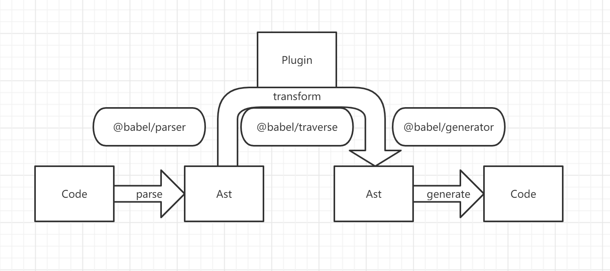
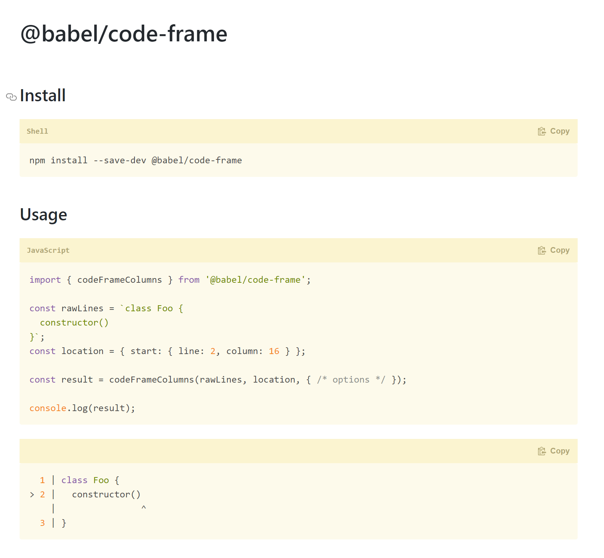

# Babel与babel插件 技术分享

```
Babel is a JavaScript compiler.
```

## babel编译过程

- 源代码通过parser转换为Ast(抽象语法树)
- Ast被插件转化为新的Ast
- Ast由generator输出编译后的代码,sourcemap



```javascript
function square(n) {
  return n * n;
}
```

```json
{
  type: "FunctionDeclaration",
  id: {
    type: "Identifier",
    name: "square"
  },
  params: [{
    type: "Identifier",
    name: "n"
  }],
  body: {
    type: "BlockStatement",
    body: [{
      type: "ReturnStatement",
      argument: {
        type: "BinaryExpression",
        operator: "*",
        left: {
          type: "Identifier",
          name: "n"
        },
        right: {
          type: "Identifier",
          name: "n"
        }
      }
    }]
  }
}
```

## plugin&perset


- perset是plugin的集合
- plugin和perset都可以有可配置的options

```js
{
    persets:["A","B"],
    plugins:["C","D"]
}
```

- 执行顺序 C->D->B->A
- plugins从前到后 persets从后到前

## 自己写一个babelPlugin

还是按照上面的例子,首先让语法树看起来像语法树


然后我们定义一个visitor

```javascript
const Visitor = {
  Identifier() {
    console.log("Called!");
  }
};
```


然后我们就可以理解为@babel/traverse 会在语法树上进行深度优先遍历

并将符合要求的结点, 执行visitor中对应的回调

- 可以指定一个节点类型作为回调

- ```javascript
  const Visitor = {
    Identifier() {
      console.log("Called!");
    }
  };
  ```

- 可以只出发进入/离开节点的回调

- ```javascript
  const Visitor = {
   Identifier: {
      enter() {
        console.log("Entered!");
      },
      exit() {
        console.log("Exited!");
      }
    }
  };
  ```

- 可以每个节点都进行访问

- ```javascript
  const Visitor = {
   enter(path) {
       console.log(path)
   }
  };
  ```

### 那访问到结点之后要进行修改操作

除了直接修改ast上的元素以外babel还提供了一些函数/模块用于更好的对ast进行修改

- @babel/types

  babel/types提供了简单的ast节点构建方法

  比如将上面的n*n换为n+n

  ```javascript
  import types from '@babel/types'
  const Visitor = {
   BinaryExpression(path) {
       path.replaceWith( types.binaryExpression("+", path.node.left, path.node.right))
   }
  };
  ```

- @babel/template

  从模板上创建ast

  ```javascript
  import template from "@babel/template";
  import types from '@babel/types'
  const buildRequire = template(`var IMPORT_NAME = require(SOURCE);`);
  
  const ast = buildRequire({
    IMPORT_NAME: types.identifier("myModule"),
    SOURCE: types.stringLiteral("my-module"),
  });
  ```

### 完整流程

```bash
npm install --save-dev @babel/core
npm install --save-dev @babel/types
```

 

```javascript
import * as babel from '@babel/core';
import types from '@babel/types';
import fs from 'fs';
const myPlugin = () => {
    return {
        visitor: {
            BinaryExpression(path) {
                path.replaceWith(types.binaryExpression("+", path.node.left, path.node.right))
            }
        }
    }
}
const fileName = "src.js"
const { code, map, ast } = babel.transformFileSync(fileName, {
    plugins: [[myPlugin]]
})
fs.writeFileSync("out.js", code)
```


## 其他神奇的功能

code-frame提供了控制台代码提示的功能 可以让编译插件标注代码段来输出一些错误❌/警告⚠信息



### babel与webpack

babel提供了babel-loader, 来在webpack构建流程中使用babel的编译器

### babel与rollup

通过 rollup-plugin-babel 在rollup的打包过程中使用babel

### babel与gulp

gulp-babel


## 除了将高版本js转换为低版本 babel还能做什么?

### 1.静态分析

JS-bridge提供了分析快应用依赖客户端接口版本的功能, 使用babel插件实现

```javascript
import bridge from "@system.app"
bridge.getInfo()
```

那么如何不运行代码就知道stoptts()被使用了呢, 通过遍历ast可以知道什么库被import成了什么符号.

然后我们在查找这个符号的操作, 比如bridge["getinfo"] bridge.getinfo()   const bridge2=brisdge , 等等

这样可以在源码层直接分析出使用了哪些方法,从而统计出依赖的版本,进行自动化构建.

### 2.mock替换

```javascript
import bridge from "@system.app" 
替换为
import bridge from "mock@system.app" 
```


## 某些小问题

### 那要是有很多插件 是一次次遍历语法树?

事实上babel是并行的, 理想状况下通过一次深度优先遍历, 在每个Ast节点依次调用插件, 最终生成对应的代码.

### babel如何处理过程中新增的代码?

比如执行插件[A,B,C] 那如果插件B添加了代码会怎么样?

babel会对新增的代码重新走[A,B,C]这个流程